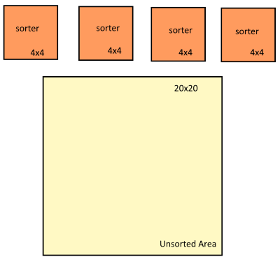
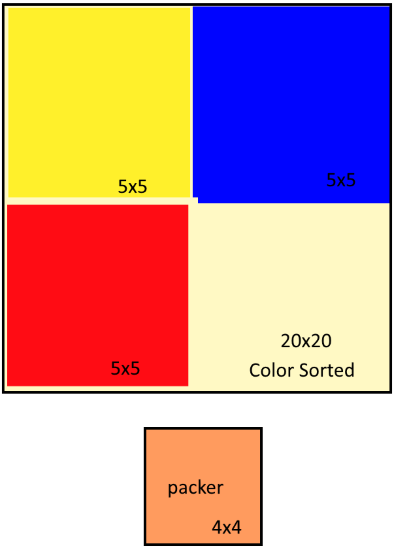

# State Machine research and planning

## Links
[Stateless:Review](https://www.hanselman.com/blog/Stateless30AStateMachineLibraryForNETCore.aspx) - [Stateless](https://github.com/dotnet-state-machine/stateless?WT.mc_id=-blog-scottha)  
[Stateless: Youtube example](https://www.youtube.com/watch?v=QxyOyCKPIzQ)  
[State machine example](https://www.c-sharpcorner.com/article/understanding-state-design-pattern-by-implementing-finite-state/)  
[Windows workflow State machine](https://docs.microsoft.com/en-us/dotnet/framework/windows-workflow-foundation/how-to-create-a-state-machine-workflow)  
[State machines video](https://www.youtube.com/watch?v=czi24DqUfSA)  
[C++ State Machines video](https://www.youtube.com/watch?v=Zb6xcd2as6o)  

## Information

### Parallel machines
Several machines are running concurrently. Some actions on the machines run in parallel, but hit a inflex point where certain actions of the machines can't continue unless another machine has hit a specific state.

## Task explained
An M&M sorter machine has several robots to sort M&Ms into 3 colours.
There is a pile of M&Ms i n a 20x20 tray and multiple 4x4 colour sorter robots take an M&M one at a time,checks its color, then places it in a special colour area (10x10) on another 20x20 tray. Detecting a yellow M&M takes .25 seconds, a red M&M takes twice as long, and detecting a blue takes three times as long as a yellow. The robot arm cannot take a M&M at the same time as another, or deposit the M&M in the color area at the same time as another robot.
Once 10 M&Ms are in a colour area another robot scoops up the M&Ms and places them in a bag, which takes a random amount of time in the sorting area to scoop up the items in the colour.
Each robot is 4x4.  
M&M unsorted tray is 20x20.  
Colour sorted tray is 20x20, with 4 areas of 10x10.  
  
  

### Caveats
Individual Robots should be able to be stopped and restarted manually.
Robots can be upgraded to operate faster/slower. 
Collision detection should be independent of the system, based on positions of robots.

